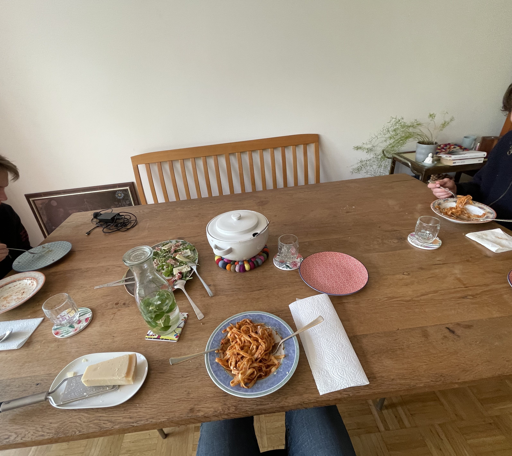
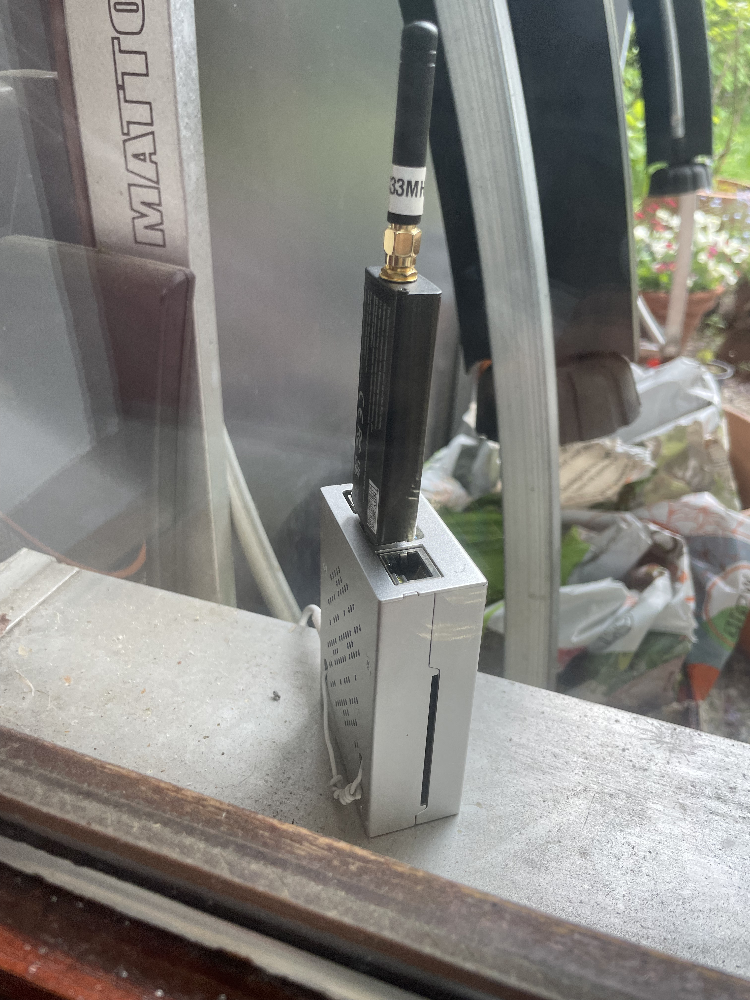
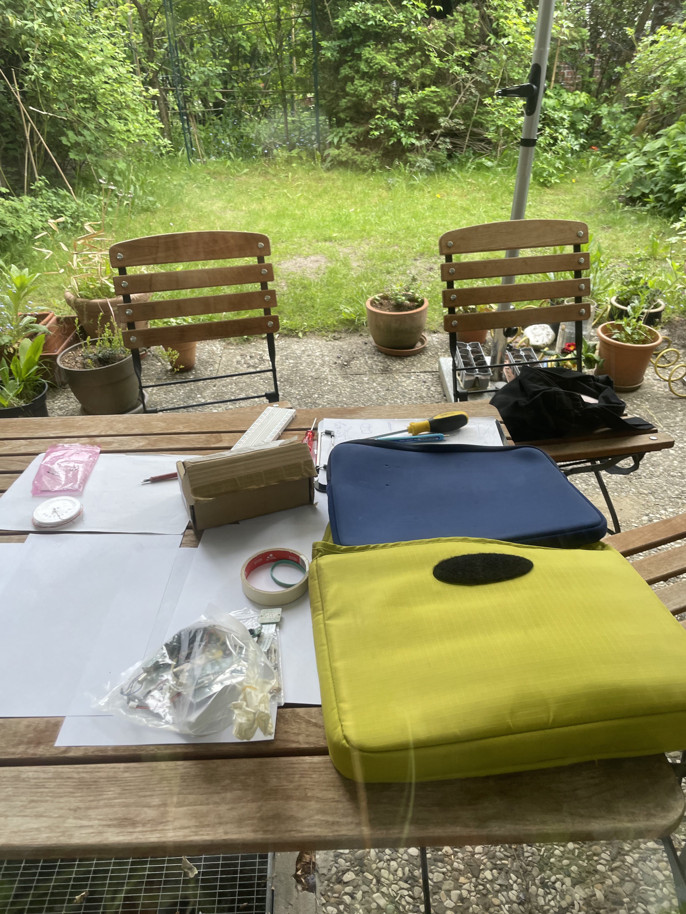
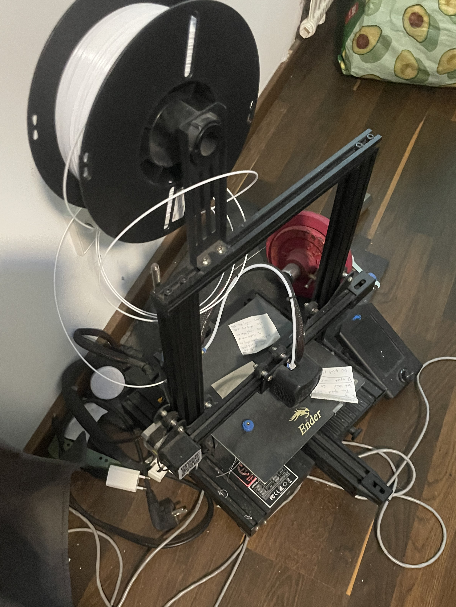

# Bau-Log — 17.05.2026 · Kickoff

*Erste gemeinsame Session. Das Ground-Station-Projekt ist offiziell
gestartet.*

## Anwesend

- Yesunkh, David, Joel

## Worum es ging

Kickoff-Tag — Team-Setup und gleichzeitig die erste echte technische
Session. Das Ziel des Abends war konkret: RTL-SDR-Daten von einem
headless Raspberry Pi an mehrere Laptops **gleichzeitig** streamen,  
live als Wasserfall in GNU Radio sichtbar. 

## Was wir geschafft haben

### Technisch

- **macOS GNU Radio Companion** zum Laufen gebracht — die Installation
hing an einem `libgfortran`-rpath-Konflikt und einem fehlenden
`librtlsdr.2.dylib`-Symlink. Beides gefixt.
- **RTL-SDR Blog V4** läuft am Raspberry Pi 4, vollständig headless
über SSH.
- **Multi-Client-Streaming funktioniert** — der Kern des Abends. Der Pi  
published den IQ-Stream, beliebig (naja, 3 in unserem Fall) viele Laptops empfangen.
- **systemd-Service `sdr-zmq*`* eingerichtet — startet beim Booten von
selbst, `Restart=always`.
- **Tailscale** — der Pi ist aus dem ganzen Tailnet erreichbar, ohne
Port-Forwarding, auch von unterwegs.
- Mehrere Bugs erlegt: `rtl_tcp`-Single-Client-Limit, `usb_claim interface error -6`, `osmosdr set_if_gain`-Segfault.

### Der entscheidende Moment

Den ganzen Abend gegen `rtl_tcp` gekämpft — `socat`, `ncat`, ein eigenes
Relay-Script: alles Sackgassen. `rtl_tcp` ist von Grund auf
single-client. Der Wechsel auf **ZMQ PUB/SUB** hat das Problem nicht  
gelöst, sondern abgeschafft — PUB/SUB ist von Natur aus one-to-many.

### Organisatorisch

- GitHub-Repo eingerichtet & Collaborators eingeladen
- Discord final, Channels stehen
- Rollen bestätigt
- Inventar zusammengelegt
- Bestellung besprochen (noch nicht fertig. Fazit war, wir muessen noch planen und experimentieren und uns generell mit der Hardware die wir haben und dessen Ramifikationen vertraut machen. Am ehesten sind wir uns einig, wir brauchen Keramikkondensatoren im nF Bereich, sowie Oszillatoren zum Mischen. Von meiner Idee, selber eine Spule aus meinem Kupferdraht und einer Klopapierrolle und einen Kondensator aus Alufolie und Papier zu wickeln waren David und Joel nicht ueberzeugt)

## Fotos & Videos

<iframe
  width="560"
  height="315"
  src="https://youtube.com/shorts/2DYfewnK92I?feature=share"
  allowfullscreen>
</iframe>
<iframe
  width="560"
  height="315"
  src="https://youtube.com/shorts/mLh5HhPSh0o?feature=share"
  allowfullscreen>
</iframe>

## Stand am Ende des Tages

- **Working:** Multi-Client-SDR-Streaming auf 433.92 MHz.
- Vollständig reproduzierbar dokumentiert in
`[/docs/reproduce.md](../docs/reproduce.md)`.

## Nächster Schritt

NOAA-Wettersatelliten-Empfang (~137 MHz) — Empfangs-Flowgraph bauen und
einen Pass abfangen.

## Extra Logs:

- David war muede. Joel auch. Beide hatten sich am Tag zuvor sehr verausgabt. Heute wurde auch viel mehr SDR/ Raspberrypi und Zeugs am Computer mit GRC gemacht und ich (Yesunkh) hat viel in Anspruch genommen, wollte unbedingt Sachen einrichten. Muss ueberlegen, wie jeder etwas zutun hat/ Spass hat. Abhaengigkeiten voneinander moeglichst minimieren, damit paralleles miteinander besser klappt.
- Joel und Yesunkh haben Therapeut gespielt. Es wurde auch viel ueber Alu-Huete geredet. Und einer Frequenz... die Menschen wohl inne haben sollen. Morpho..-irgendwas. 
- Man will anmerken, dass wir alle drei recht wenig Erfahrung mit Elektrotechnik haben (ausser ich, theoretisch...) und erst recht in Praxis. Um zu sehen, ob ueberhaupt etwas an der Antenne passiert, wurde das SDR an Joel's Windows Laptop angeschlossen, und dann mittels (hier gab's einen kurzen Abstecher in Zodig Driver Manager) GRC ein Wasserfalldiagramm geoeffnet. Yesunkh's Arduino Mega 2560 wurde mit einem arbitrary code geflasht, auf Joel's Laptop wurde Center-Frequency von 16.0e6 eingestellt (die Taktfrequenz des Arduino Mega) und dann konnte man auf dem Wasserfalldiagramm sehen, wie sehr leicht gelbe Streifen zu sehen waren, die mit Abstand vom Arduino verschwinden, und bei sehr hoher Proximitaet auftauchen. 
- Weiterhin wurde mittels Keyfob (fuer Auto) getestet, ob dann ein Signal zu sehen ist (hat geklappt) und dann wurde damit auch getestet, ob unser Setup auf dem Raspberry Pi klappt. 
- Der Raspberry Pi stand erst draussen, aber wurde zum Ende hin drinne in Joel's Zimmer aufgestellt.

Bug 1 — libgfortran / duplicate rpath. GNU Radio braucht NumPy → NumPy braucht libopenblas → das braucht libgfortran.5.dylib. Die Datei war da, aber der macOS-Loader hat sie abgelehnt wegen duplicate LC_RPATH '@loader_path' — also ein doppelter Suchpfad-Eintrag in der Bibliothek. Neuere macOS-Versionen behandeln einen doppelten rpath als harten Fehler. Analogie: ein Kontakteintrag mit derselben Telefonnummer zweimal drin — die Nummer stimmt, aber das strenge neue OS verwirft die ganze Karte. Fix: den doppelten rpath-Eintrag mit install_name_tool -delete_rpath aus den betroffenen Libraries entfernen.
Folgefehler — kaputte Code-Signatur. Sobald install_name_tool eine .dylib editiert, wird ihre kryptografische Signatur ungültig. macOS auf Apple Silicon hat dann die Prozesse, die diese Libraries laden wollten, einfach abgeschossen (zsh: killed). Fix: die editierten Dateien mit codesign --force --sign - neu ad-hoc-signieren.
Bug 2 — fehlender librtlsdr.2.dylib-Symlink. Beim SpyServer-Versuch: Soapys RTL-SDR-Plugin suchte nach librtlsdr.2.dylib. Die echte Datei (librtlsdr.2.0.1.dylib) war da, mit Symlinks .0.dylib, .dylib, .so.2 — aber genau der Name .2.dylib fehlte. Eine Packaging-Lücke. Fix: den fehlenden Symlink anlegen (ln -s librtlsdr.2.0.1.dylib librtlsdr.2.dylib).
Gemeinsamer Nenner beider Mac-Bugs: radioconda auf neuem macOS — Libraries, deren Referenzen/Namen nicht sauber aufgelöst wurden.
